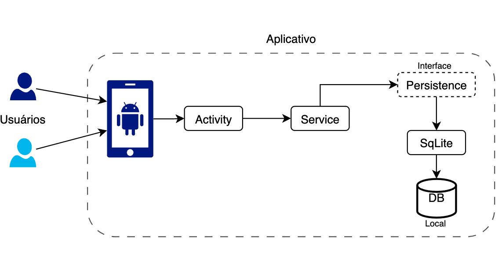

# Sweet Dreams App

Projeto feito para entrega do PIT 2 do curso de Engenharia de Software.

## O APK se encontra no diretório ./docs
[Link de suporte para navegar até o apk](docs/app-debug.apk)

## PIT 1 - Atualizado

## PIT 2 - Documentação

## Link do Youtube:
[Vídeo narrado](https://www.youtube.com/watch?v=OZCOEWqT0Rs)
- Sumário do vídeo:
- 00:00 - Introdução
- 00:32 - Arquitetura Geral
- 05:33 - Injeção de Dependência
- 07:54 - Seeds
- 09:08 - Testes
- 11:13 - CI (GH Actions)
- 12:23 - Rodando o APP
- 15:35 - Features Lojista
- 18:26 - Features Cliente
- 22:30 - Segurança Senhas

## Arquitetura do projeto
